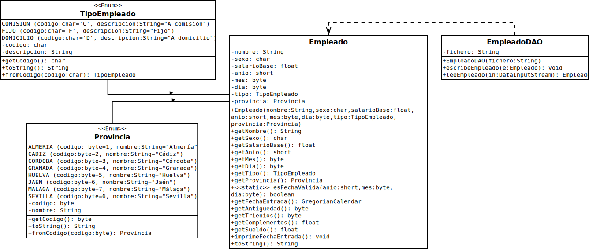

# Diagrama 

La línea continua de `Empleado` hacia las enumeraciones pretende indicar que la definición de Empleado **depende** de dichas enumeraciones. 
La línea discontinua de `EmpleadoDAO` hacia `Empleado` pretende indicar que existe una **asociación** entre las clases (aunque es bien cierto que según este esquema la relación también es estructural (no había otra forma de hacerlo. Quiero decir, había otra manera pero era un poco ridícula.)) `EmpleadoDAO` es la clase auxiliar que hace de puente entre el fichero y el objeto y es la que permite la lectura y escritura según un esquema ordenado. Por eso se llama **DAO** Data Access Object. (Aunque la "asociación" sí es **estructural**, por lo que sí hay dependencia.)
